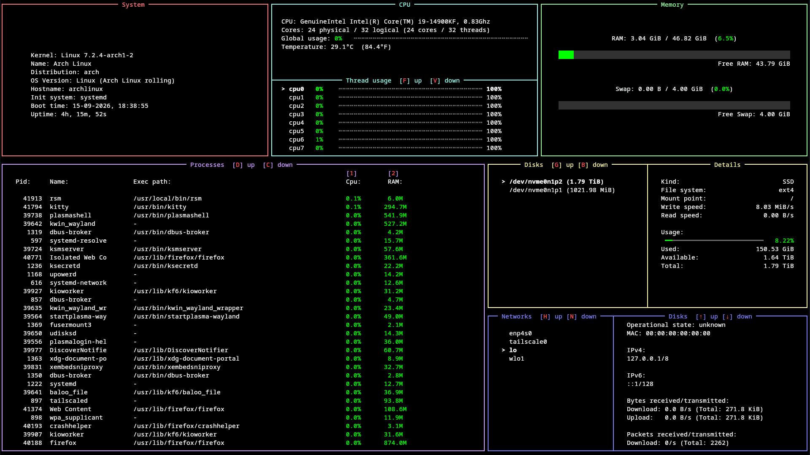

# Rust System Monitor
## Description
RSM (Rust System Monitor) is a resource monitor designed to be straightforward, easy to use and lightweight. It shows system information, CPU & memory usage, active processes list and stats for disks
and networks, all in a clean and minimalistic UI.


## Features
* **Lightweight & fast:** Written in Rust with minimal overhead.  
* **Real-time resource monitor:** Provides nicely-presented statistics about OS, CPU, memory, processes, disks and networks - refreshed every 1 second.  
* **Readability:** Focuses on clean and readable UI.  

## Installation
### Using Cargo
If you have Rust installed, you can install it using Cargo:  
```bash  
cargo install rust-system-monitor
```
### Linux
You can download and run the installation script by pasting this command:
```bash
curl -fsSL https://raw.githubusercontent.com/r3nzgmd/rsm/main/install.sh | sudo sh
```
Then, open the program by typing:
```bash
rsm
```
Note: make sure you have the folder `/usr/local/bin` added to PATH.

### Windows
Open `cmd` and paste in this command:
```bash
curl -fL "https://github.com/r3nzgmd/rsm/releases/download/v1.0.0/rsm-windows.exe" -o "%USERPROFILE%/Downloads/rsm.exe"
```
Note: file `rsm.exe` will end up in your Downloads folder.

## Compilation
If you want to compile the code yourself on your machine, you will need `rustc v1.97.1` or later. Then, run this command to clone the repository and build from source code:
```bash
curl -fsSL https://raw.githubusercontent.com/r3nzgmd/rsm/main/compile.sh | sh
```
